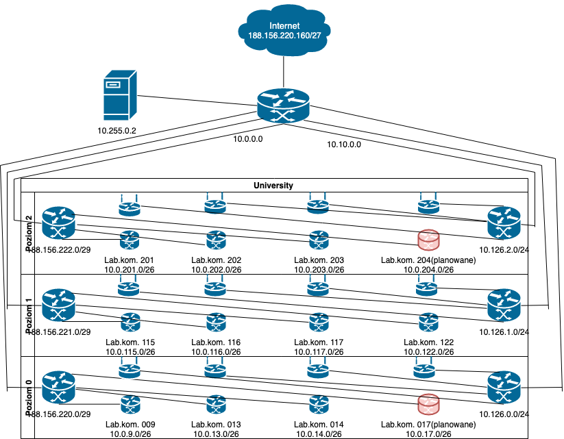

# Zadanie 2
### Podział sieci
#### Maski sieci
* Dla sieci na poszczególne Piętro - 255.255.255.248 /29
* Dla każdego Laboratorium Komputerowego (35 stanowisk) - 255.255.254.192 /26
* Dla WIFI (maks. 800 urządzeń - po 200 na piętro) - 255.255.252.0 /24
#### Adresy sieci
| Adres | Lokalizacja |
|------------------|---------------------
| ``` 188.156.220.0/29 ``` | Poziom 0 |
| ``` 10.0.9.0/26 ``` | Lab. kom. 009 |
| ``` 10.0.13.0/26 ``` | Lab. kom. 013 |
| ``` 10.0.14.0/26 ``` | Lab. kom. 014 |
| ``` 10.0.17.0/26 ``` | Lab. kom. 017 (planowane) |
| ``` 188.156.221.0/29 ``` | Poziom 1 |
| ``` 10.0.115.0/26 ``` | Lab. kom. 115 |
| ``` 10.0.116.0/26 ``` | Lab. kom. 116 |
| ``` 10.0.117.0/26 ``` | Lab. kom. 177 |
| ``` 10.0.122.0/26 ``` | Lab. kom. 122 |
| ``` 188.156.222.0/29 ``` | Poziom 2 |
| ``` 10.0.201.0/26 ``` | Lab. kom. 201 |
| ``` 10.0.202.0/26 ``` | Lab. kom. 202 |
| ``` 10.0.203.0/26 ``` | Lab. kom. 203 |
| ``` 10.0.204.0/26 ``` | Lab. kom. 204 (planowane) |
| ``` 10.126.0.0/24 ``` | Poziom 0 Wifi |
| ``` 10.126.1.0/24 ``` | Poziom 1 Wifi |
| ``` 10.126.2.0/24 ``` | Poziom 2 Wifi |

#### Diagram


#### Routing
w ```/etc/network/interfaces```

pokolei w routerach:

```up ip rotue add default via 188.156.220.1```

kolejne labolatoria komputerowe:

```up ip route add default via 10.0.9.62```

```up ip route add default via 10.0.13.62```

```up ip route add default via 10.0.14.62```

```up ip route add default via 10.0.17.62```

```...```
