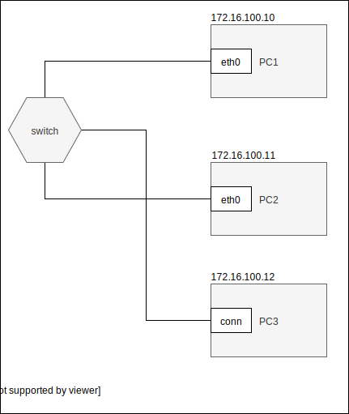

Ustawianie parametrów sieci ip
------------------------------

* stan interfejsu
    * interfejs up
    * interfejs down
* adresacja
    * dodaj adres
    * zmień adres
    * usuń adres
* routing
    * dodaj trasę default
    * dodaj trasę przez bramę
    * dodaj trasę przez interfejs
    * usuń trasę
    * zmień trasę
    * pobierz trasę dla adresu
* adresacja fizyczna
    * pokaż adresy interfejsów dostępnych w sieci
    * pokaż adresy dla konkretnego interfejsu
     

ip 
-------------------------
| subcommand    |  polecenie   | opis  |
| ------------- |:-------------| :---------------| 
|   ``addr``    |                               | Informacje o adresacji i własnościach interfejsów |
|               |   ``ip addr``                 | Informacja o wszystkich interfejsach              |
|               |   ``ip addr show dev enp0s3`` | Informacja o konkretnym interfejsie               |
|   ``link``    |   ``ip link set enp0s3 up/down``             | Polecenie to służy do zmiany ustawień istniejących interfejsów (włącz/wyłącz) |
|   ``route``   | ``ip route add default via 192.168.0.1`` | Polecenie ip route służy do zarządzania tablicami routingu wewnątrz jądra. Pozwala na dodawanie, usuwanie i modyfikowanie tras. Składnia polecenia wyświetlana za pomocą polecenia `ip route help` |
|   ``maddr``   | ``ip maddr add/del/show``  | Zarządzanie rozsyłaniem adresów |
|   ``neigh``   | ``ip neigh add/del/change/show/replace -> ip neigh show to 192.168.0.0/24`` | Polecenie to służy do dodawania nowego wpisu w tablicy sąsiedztwa. Polecenie obok wyświetli tablicę sąsiedztwa dla hostów z podsieci 192.168.0.0/24 |
|   ``help``    | ``ip help`` | Wyświetlenie informacji o poleceniu ip |

Zadanie
------------

1.
   * Przygotuj konfigurację sieci zgodnie z powyższym diagramem, 
   * Przetestuj połączenie poleceniem ping
2.
   * Zainstaluj na komputerze ``PC1`` serwer programu ``HTTP CHAT`` dostępnego pod adresem ``https://github.com/jkanclerz/http-chat``
   * Przetestuj komunikację wysyłając wiadomość z komputera ``PC2``, upewnij się czy jest widoczna w konsoli serwera
3.
   * Dodaj do istniejącej sieci komputer ``PC3`` pod kontroloą systemu windows
   * Skonfiguruj ``PC3`` zgodnie z poniższym diagramem
   * Zweryfkuj połączenie kożystając z przeglądarki, odwiedzając graficzny interfejs ``HTTP CHAT`` pod adresem ``http://172.16.100.10:8888``
   * Przygotuj dokumentację pisemno obrazkową z wykonania zadania w formacie ``markdown`` zamieść ją w serwisie ``github.com`` obok obocnego tematu ``cwiczenia-3``

 
