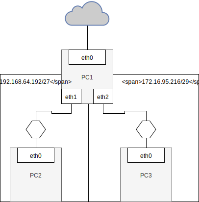

NAT - Network address translation
----------------------------------

  * https://linux.die.net/man/8/iptables

Zadanie
------------

1.
   * Przygotuj konfigurację sieci zgodnie z powyższym diagramem
   * Zweryfikuj poprawność połączenia z siecią internet dla ``PC0``
      * adresacja
   * W pierwszej kolejności przygotuj ``PC0``, ``PC-1``
   * Uruchom usługe ``ip_forward`` dla ``PC0``
   * Do konfiguracji wykorzystaj właściwą konfigurację ``VirtualBox`` która pozwoli na dostęp do internetu dla ``PC-1`` za pomocą interfejsu ``eth0``
   * Wykonaj konfigurację translacji adresów tak aby udostępnic komunikację z siecią internet dla ``PC-2``
   * Przygotuj dokumentację powyższego procesu
   *  **czy istnieje różnica keżeli adres eth0 statyczny/dynamiczny? Jeżeli to jaka?**

2. 
    * Przygotuj konfigurację sieci zgodnie z powyższym diagramem
    * Wykonaj konfigurację translacji adresów tak aby udostępnic komunikację z siecią internet dla ``PC-2`` oraz ``PC-3``
    
3. 
    * Rozszerz architekturę o automatyczną konfigurację hostów w podsieciach ``192.168.64.192/27`` oraz ``172.16.95.216/29`` z wyykorzystaniem usługi ``DHCP``
    * Rozpocznij od zapoznania się z dokumentacją oraz instalacji programu ``isc-dhcp-server`` dla ``PC1``

 

Zadanie do domu
---------------

1. Wykorzystując program ``dia`` oraz ikony CISCO
  * Przygotuj diagram powyższej sieci uwzględniając urządzenia tj:
    * ROUTER
    * SWITCH
    * PC
  
