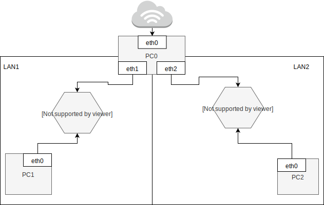

Zadanie 1
---------

1. Zaprojektuj oraz przygotuj prototyp rozwiązania z wykorzystaniem oprogramowania ``VirtualBox`` lub podobnego. 
Zaproponuj rozwiązanie spełniające poniższe wymagania:
   * Usługodawca zapewnia domunikację z siecią internet poprzez interfejs ``eth0`` ``PC0``
   * Zapewnij komunikację z siecią internet na poziomie ``LAN1`` oraz ``LAN2``
   * Dokonaj takiego podziału sieci o adresie ``172.22.128.0/17`` aby w ``LAN1`` można było zaadresować ``500`` adresów natomiast w LAN2 ``5000`` adresów    
   * Przygotuj dokumentację powyższej architektury w formie graficznej w programie ``DIA``
 