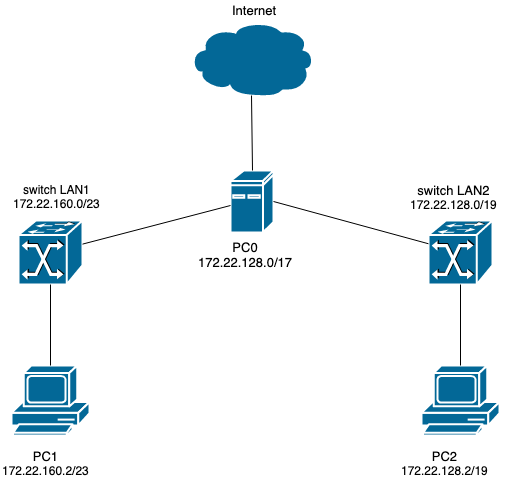

# Zadanie 1
### Podział sieci
#### Maski sieci
* Dla 500 urządzeń - 255.255.254.0 (/23)
* Dla 5000 urządzeń - 255.255.224.0 (/19)
#### Adresy sieci
  | Sieć | Adres sieci | Zakres hostów | Maks. liczba hostów | Adres rozgłoszeniowy |
  | ----- |:------------- |:-------------| :-------------|:-------------|
  | ``LAN2`` |   ``172.22.128.0/19``    | ``172.22.128.1 - 172.22.159.254 `` | ``8190`` | ``172.22.159.255`` |
  | ``LAN1`` |   ``172.22.160.0/23``    | ``172.22.160.1 - 172.22.161.254 `` | ``510`` | ``172.22.161.255`` |

### Konfiguracja
#### PC0
*Przypisanie adresów i masek podsieci do interfejsów*
* ```ip addr add 172.22.160.1/19 dev enp0s8```
* ```ip addr add 172.22.128.1/23 dev enp0s9```

*Włączenie przekierowania pakietów i dodanie reguły masquerade*
* ```echo 1 > /proc/sys/net/ipv4/ip_forward```

LAN1
* ```iptables -t nat -A POSTROUTING -s 172.22.160.0/23 -o enp0s3 -j MASQUERADE```

LAN2
* ```iptables -t nat -A POSTROUTING -s 172.22.128.0/19 -o enp0s3 -j MASQUERADE```

*Aktywacja interfejsów*
* ```ip link set enp0s3 up```
* ```ip link set enp0s8 up```
* ```ip link set enp0s9 up```

#### PC1
*Przypisanie adresów i masek podsieci do interfejsów*
* ```ip addr add 172.22.160.2/23 dev enp0s3```

*Ustalenie routingu*
* ```ip route delete default```
* ```ip route add default via 172.22.160.1 dev enp0s3```

#### PC2
*Przypisanie adresów i masek podsieci do interfejsów*
* ```ip addr add 172.22.128.2/19 dev enp0s3```

*Ustalenie routingu*
* ```ip route delete default```
* ```ip route add default via 172.22.128.1 dev enp0s3```

### Diagram

