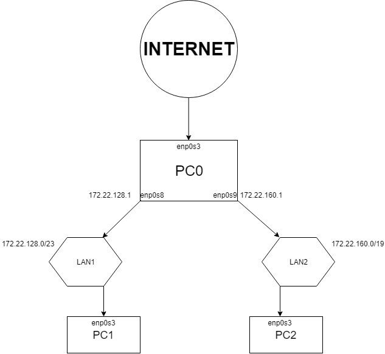

# 1. Podział sieci

a) maska sieci:

  500 urządzeń jest to ``255.255.254.0`` (/23)
  
  5000 urządzeń jest to ``255.255.224.0`` (/19)
  
b) podział sieci:
  pierwsza sieć ``LAN1``: zaczyna się od IP ``172.22.128.0`` (bazowe)
  
  druga sieć ``LAN2``: jako, że sieć ``LAN1`` posiada (2^(32-2)-2 = 510 adresów), to następna (dla /19) zacząć się może dopiero od adresu ``172.22.160.0``
  
  Podsumowując adresy sieci:
    ``LAN1``: 172.22.128.0/23
    ``LAN2``: 172.22.160.0/19

# 2. Konfiguracja interfejsów PC0

### /etc/network/interfaces

```
auto enp0s8
iface enp0s8 inet static
  address 172.22.128.1
  netmask 255.255.254.0
atuo anp0s9
iface enp0s9 inet static
  address 172.22.160.1
  netmask 255.255.224.0
  ```
  
# 3. Konfiguracja PC1 i PC2

## /etc/network/interfaces

#### PC1:
```
iface enp0s3 inet static
  address 172.22.128.2
  netmask 255.255.254.0
up ip route add default via 172.22.128.1 ///routing 
```

#### PC2:
```
face enp0s3 inet static
  address 172.22.160.2
  netmask 255.255.224.0
up ip route add default via 172.22.160.1 ///routing
```

# 4. Forwardowanie pakietów (PC0):

``echo 1 > /proc/sys/net/ipv4/ip_forward``

Odkomentować linię ``net.ipv4.ip_forward=1`` w pliku ``/etc/sysctl.d/99-sysctl.conf``

# 5. Reguła MASQUERADE na PC0:

W terminalu wpisać:

```
iptables -t nat -A POSTROUTING -s 172.22.128.0/23 -o enp0s3 -j MASQUERADE
iptables -t nat -A POSTROUTING -s 172.22.160.0/19 -o enp0s3 -j MASQUERADE
```

Oraz:

``ipatables-save > /etc/iptables.up.rules``
